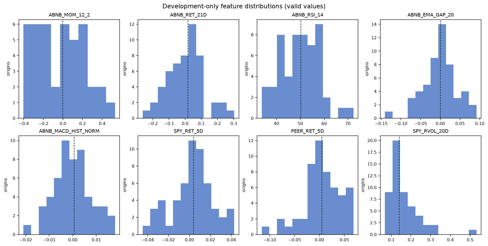
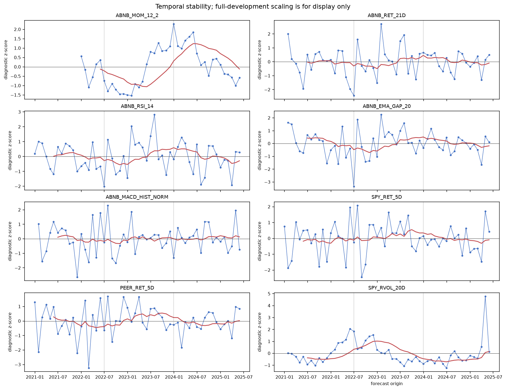
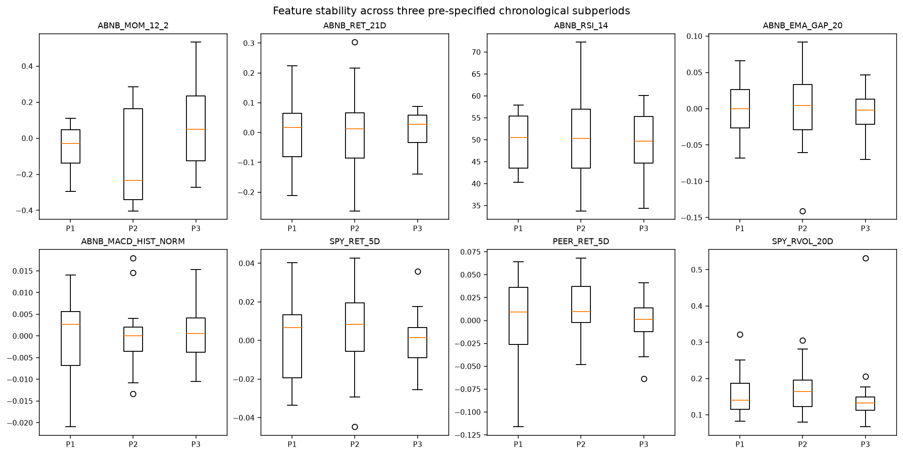
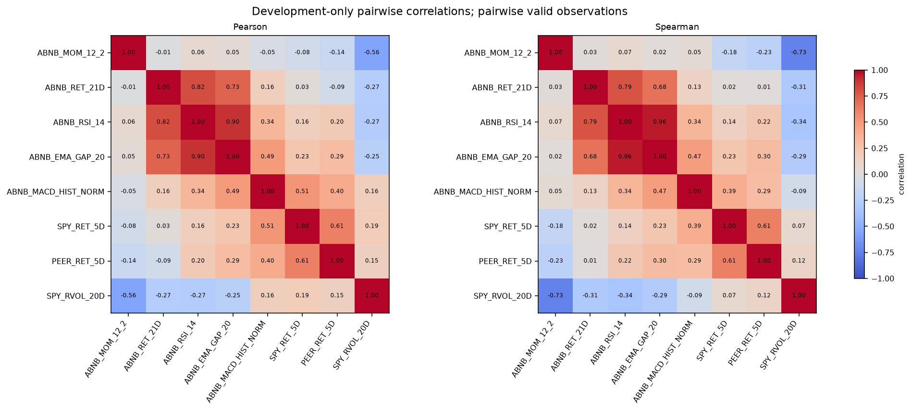
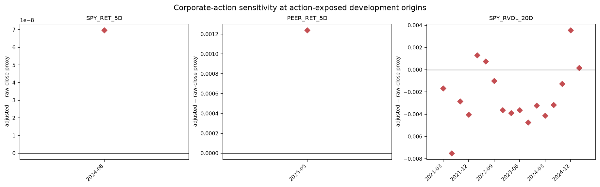

# Development-period feature diagnostics

**Scope:** 2020-12-31T00:00:00 through 2025-05-30T00:00:00 only (54 monthly origins).  
**Interpretation:** implementation and stability diagnostics only. These checks do not establish feature predictiveness and were not used to alter the locked feature set or frozen evaluation protocol.

## Executive findings

- Missing values are status-bearing rather than silently filled. The complete eight-feature sample contains 42 of 54 origins; the loss is attributable to documented warm-up statuses.
- The largest absolute Pearson correlation is `ABNB_RSI_14` versus `ABNB_EMA_GAP_20` at 0.901. The maximum VIF is 8.461, and the standardized complete-case condition number is 6.862.
- Across the frozen development targets, three-month overlap reduces the design-based non-overlap equivalent from 54 to 18.0. On the complete-feature subset it is 42 to 14.0.
- ABNB has no registered corporate action in development. The action-date sensitivity check therefore focuses on SPY and peer features and compares the locked adjusted-price feature with the same formula on raw closes; exposed-origin counts are small and descriptive.

## Missingness and statuses

| Feature | Rows | Missing | Status counts |
|---|---|---|---|
| ABNB_MOM_12_2 | 54 | 12 | VALID=42, INSUFFICIENT_HISTORY=12 |
| ABNB_RET_21D | 54 | 1 | VALID=53, INSUFFICIENT_HISTORY=1 |
| ABNB_RSI_14 | 54 | 0 | VALID=54 |
| ABNB_EMA_GAP_20 | 54 | 1 | VALID=53, INSUFFICIENT_HISTORY=1 |
| ABNB_MACD_HIST_NORM | 54 | 1 | VALID=53, INSUFFICIENT_HISTORY=1 |
| SPY_RET_5D | 54 | 0 | VALID=54 |
| PEER_RET_5D | 54 | 0 | VALID=54 |
| SPY_RVOL_20D | 54 | 1 | VALID=53, INSUFFICIENT_HISTORY=1 |

Counts by each of the three fixed chronological subperiods are in `development_feature_diagnostics.json`.

## Distributions and extreme values

| Feature | Valid n | Median | 5th–95th percentile | Tukey extremes |
|---|---|---|---|---|
| ABNB_MOM_12_2 | 42 | -0.002 | [-0.384, 0.363] | 0 |
| ABNB_RET_21D | 53 | 0.017 | [-0.182, 0.196] | 1 |
| ABNB_RSI_14 | 54 | 50.277 | [37.044, 60.352] | 0 |
| ABNB_EMA_GAP_20 | 53 | 0.000 | [-0.067, 0.065] | 2 |
| ABNB_MACD_HIST_NORM | 53 | 0.001 | [-0.013, 0.014] | 2 |
| SPY_RET_5D | 54 | 0.004 | [-0.032, 0.035] | 1 |
| PEER_RET_5D | 54 | 0.005 | [-0.068, 0.065] | 1 |
| SPY_RVOL_20D | 53 | 0.140 | [0.087, 0.291] | 3 |

Exact fences and dated extreme observations are in the JSON artifact. Tukey flags identify observations for implementation review; they are not deletion rules.

## Temporal behavior and structural change

The temporal panels use full-development z-scores only for visual comparability; those scalers are not model inputs. Dashed vertical lines mark the fixed 18-origin subperiod boundaries, and the red line is a 12-origin rolling mean.

| Feature | First-to-last SMD | SD ratio | KS statistic |
|---|---|---|---|
| ABNB_MOM_12_2 | 0.633 | 1.526 | 0.389 |
| ABNB_RET_21D | 0.104 | 0.636 | 0.183 |
| ABNB_RSI_14 | -0.113 | 1.243 | 0.167 |
| ABNB_EMA_GAP_20 | -0.106 | 0.657 | 0.239 |
| ABNB_MACD_HIST_NORM | 0.121 | 0.682 | 0.252 |
| SPY_RET_5D | -0.023 | 0.656 | 0.278 |
| PEER_RET_5D | 0.050 | 0.516 | 0.278 |
| SPY_RVOL_20D | -0.110 | 1.555 | 0.255 |

The JSON includes all subperiod means, standard deviations, medians, and interquartile ranges. KS p-values are retained only as descriptive diagnostics and are not predictive or confirmatory tests.

## Correlations and multicollinearity

Pairwise Pearson and Spearman correlations use all jointly valid observations for each pair. VIF and condition indices use the 42 complete eight-feature rows. Pseudoinverse VIFs are reported so the diagnostic fails gracefully if exact singularity occurs.

## Corporate-action sensitivity

| Feature | Exposed origins | Valid origins | Mean absolute difference | Max absolute difference |
|---|---|---|---|---|
| SPY_RET_5D | 1 | 54 | 0.000000 | 0.000000 |
| PEER_RET_5D | 1 | 54 | 0.001240 | 0.001240 |
| SPY_RVOL_20D | 17 | 53 | 0.002971 | 0.007496 |

An origin is exposed when a registered action lies inside the exact session-offset window used by the feature. Raw-close proxies are sensitivity comparators, not candidate replacements.

## Effective sample size under overlapping outcomes

| Sample | Nominal n | N/3 non-overlap equivalent | Phase counts | Lag-1 target autocorrelation | Lag-2 target autocorrelation | Bartlett HAC variance-equivalent n |
|---|---:|---:|---|---:|---:|---:|
| All valid development targets | 54 | 18.0 | [18, 18, 18] | 0.521 | -0.051 | 32.864 |
| Complete-feature valid targets | 42 | 14.0 | [14, 14, 14] | 0.541 | -0.026 | 24.648 |

The N/3 figure is the design-based headline. Empirical autocorrelation/HAC equivalents can move materially in short samples and are reported only as sensitivity diagnostics.

## Reproducibility and limitations

- Final-test and post-test rows were excluded in the Arrow scan before materialization. No final-test feature or target value was read into the diagnostic process.
- Corporate-action comparison uses only registered rows through the development cutoff and stops streaming each source at the first later date.
- Inputs remain development-only because point-in-time adjustment evidence and usage rights are unresolved. See `../../validation/DATA_LIMITATIONS.md`.
- Full numerical results, definitions, input hashes, code revision, and build metadata are in `development_feature_diagnostics.json` and `artifact_manifest.json`.
